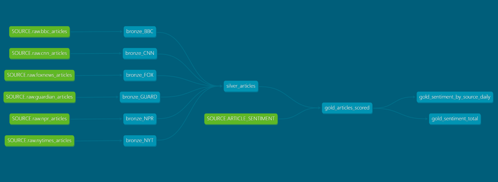

# News Sentiment Pipeline

An end-to-end data engineering pipeline that ingests articles from 6 major news sources daily, transforms them through a medallion architecture in Snowflake using dbt, scores each article's political sentiment with GPT-4.1-mini, and surfaces aggregated insights in the gold layer.

## Architecture

```
6 News Sources (RSS/API)
        │
        ▼
  [Airflow DAG]  ──── runs daily ────────────────────────────────────┐
        │                                                             │
   extract_*                                                          │
        │                                                             │
        ▼                                                             │
  Snowflake RAW  (raw.bbc_articles, raw.cnn_articles, ...)           │
        │                                                             │
        ▼                                                             │
  dbt bronze  (deduplicated per source, incremental on link)         │
        │                                                             │
        ▼                                                             │
  dbt silver  (unified schema across all sources)                    │
        │                                                             │
        ▼                                                             │
  GPT-4.1-mini scoring  (sentiment: -1.0 → 1.0 per article)         │
        │                                                             │
        ▼                                                             │
  dbt gold                                                           ◄┘
    ├── gold_articles_scored
    ├── gold_sentiment_by_source_daily
    └── gold_sentiment_total
```

## Stack

| Layer | Tool |
|---|---|
| Orchestration | Apache Airflow (daily DAG) |
| Transformation | dbt Core + dbt-snowflake |
| Warehouse | Snowflake |
| Scoring | OpenAI GPT-4.1-mini |
| Ingestion | Python (feedparser, requests, trafilatura) |
| Package management | uv |

## Sources

BBC · CNN · Fox News · The Guardian · NPR · The New York Times

## Pipeline Stages

1. **Extract** — 6 parallel Airflow tasks pull articles via RSS feeds and APIs, writing raw JSON to Snowflake
2. **Bronze** — dbt incremental models deduplicate articles per source by `link`, appending only new records each run
3. **Silver** — unified schema across all sources (`headline`, `body`, `source`, `timestamp`, `link`)
4. **Score** — GPT-4.1-mini assigns a sentiment score from -1.0 (negative) to 1.0 (positive) for each unscored article
5. **Gold** — dbt aggregates scores by source and date for downstream consumption

## dbt Lineage



## Project Structure

```
news-pipeline/
├── dags/
│   └── my_pipeline_dag.py       # Airflow DAG wiring all stages
└── news/
    ├── news_extract.py          # Source extractors (BBC, CNN, FOX, Guardian, NPR, NYT)
    ├── news_score.py            # GPT-4.1-mini scoring + Snowflake write
    └── news_sentiment/          # dbt project
        └── models/
            ├── bronze/          # Per-source incremental tables
            ├── silver/          # Unified articles table
            └── gold/            # Sentiment aggregations
```

## Setup

**Prerequisites:** Snowflake account, OpenAI API key, Python 3.12+, uv, Airflow

```bash
# Install dependencies
cd news
uv sync

# Configure credentials
cp .env.example .env   # fill in Snowflake + OpenAI credentials

# Run dbt
cd news_sentiment
uv run dbt run
uv run dbt test

# Start Airflow
cd ../..
airflow standalone
```

## Running the Pipeline

**Manual run via Airflow UI:** trigger `my_pipeline` DAG

**Manual run via CLI:**
```bash
cd news
uv run python -c "import news_extract; news_extract.extract_guardian()"
cd news_sentiment && uv run dbt run
cd .. && uv run python -c "import news_score; news_score.score()"
```
